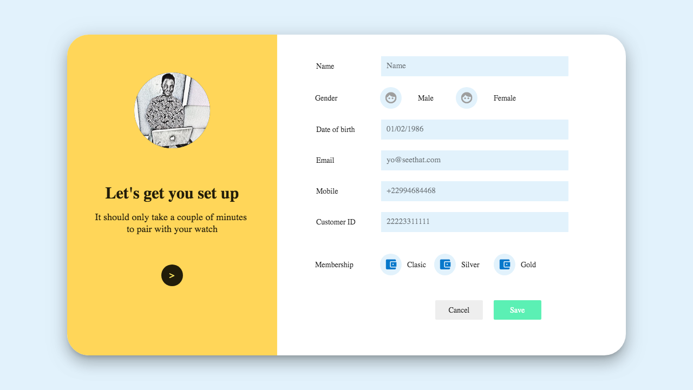

# 😁 LoginPage 

A very simple Login Page made with Flutter Web.

Inspired by [This Uplabs Post](https://www.uplabs.com/posts/freebies)

## 📸 ScreenShots

## ✨ Requirements
* Any Operating System (ie. MacOS X, Linux, Windows)
* Any IDE with Flutter WEB installed (ie. IntelliJ, Android Studio, VSCode etc)
* A little knowledge of Dart and Flutter
* A brain to think 🤓🤓

## ‼️ Disclaimer

This is just a simple project i made as my **second Flutter web project** for practice sake, took only a few hours so its not **perfect**

## 🤓 Author(s)
**Olusegun Festus Babajide**

## Getting Started
For help getting started with Flutter, view the [online documentation](https://flutter.dev/web).